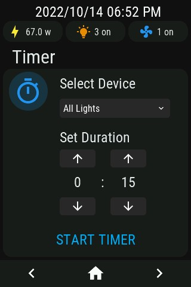

# openHASP Mushroom-like cards

Here is my personal configuration for openHASP, using a 320x480 TFT lcd from a Wirelass Tag module (wt32-sc01).
All of the look/feel inspired by the excellent Mushroom cards for Home Assistant.

## How to use

[Set up openHasp](https://www.openhasp.com/0.6.3/getting-started/) on your device.

If you just want to see how it looks on the device, [copying the content of pages.jsonl](https://www.openhasp.com/0.6.3/faq/#is-there-a-file-browser-built-in) to the microcontroller should be enough to get you started.

For a more complete installation, you will need to integrate the content of configuration.yaml to your own configuration.yaml, with taking care to replace all the entities id with your own.

## Setting up the page3 Timer functionality

Make sure you've completed the previous steps before proceeding. We will need to tweak a script and configure 3 helpers for the Timer functionality to work.

 1. Create a dropdown helper with all the names of your entities. The last item in the dropdown should be "(none)" or "Nothing Selected", as we will use that option to reset the dropdown

 2. Edit the content of scripts.yaml. Replace all the entity names and ids with the entities you populated on the dropdown just earlier. Create a new script in Home Assistant with that content. I named mine plate02_settimer

 3. Create a Number helper named input_number.plate02_timer_hour with a minimum value of 0

 4. Create a Number helper named input_number.plate02_timer_minute with a minimum value of 0 and a maximum of 59

## Design/Style guide

The cards were designed for a 320x480 TFT lcd in portrait mode. The status bar is 35pixel high while the footer navigation is 45 pixels, leaving 400 pixels for content. The cards I have built try to stick to 80pixels in height whenever possible, but allowing for 40pixels and 120pixels cards too

ps: media controls for the Samsung TV on page 2 aren't implemented

## Screensots

page 1

page 2

page 3

page 4

